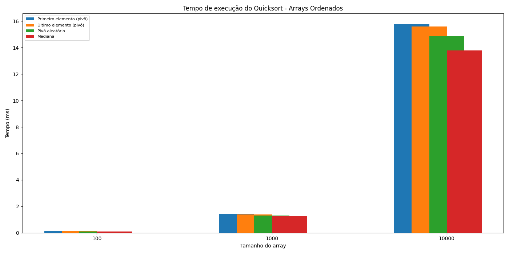
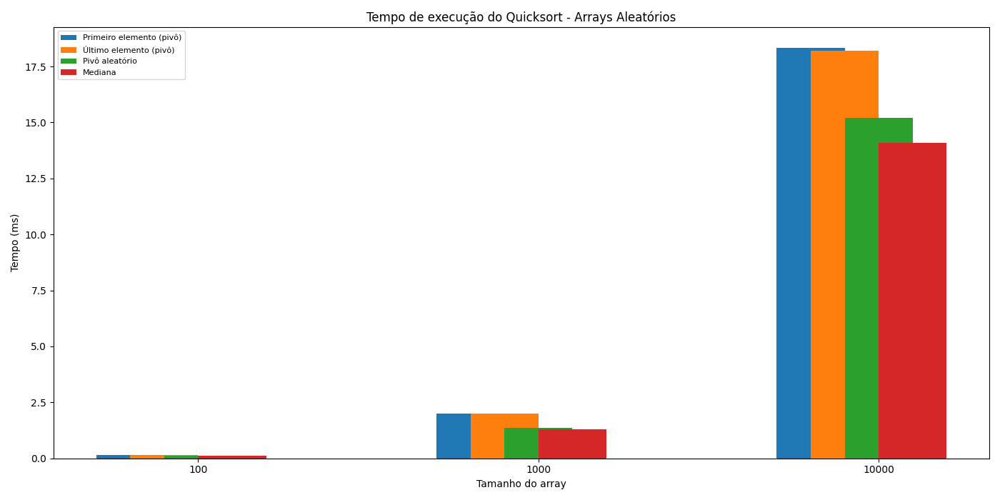

# Relatório Quicksort - Thales Duque Câmara

## 1. Funcionamento de cada estratégia de escolha do pivô

- **Primeiro elemento como pivô:**  
O algoritmo sempre escolhe o primeiro elemento do subarray como pivô. É simples, mas pode gerar pior desempenho em arrays já ordenados ou quase ordenados, pois pode causar partições desbalanceadas.

- **Último elemento como pivô:**  
Similar ao anterior, mas escolhe o último elemento do subarray como pivô. Também pode gerar partições ruins em casos ordenados.

- **Pivô aleatório:**  
O pivô é escolhido aleatoriamente dentro do subarray. Isso reduz a chance de encontrar o pior caso, tornando o algoritmo mais estável para diferentes tipos de entrada.

- **Mediana de três:**  
O pivô é escolhido como a mediana entre o primeiro, o último e o elemento do meio do subarray. Essa estratégia busca evitar partições desbalanceadas, melhorando o desempenho em arrays ordenados e quase ordenados.

---

## 2. Desempenho observado em cada cenário

### Tabela de tempos para arrays ordenados (ms)

| Estratégia                | 100 elementos | 1000 elementos | 10000 elementos |
|---------------------------|---------------|----------------|-----------------|
| Primeiro elemento (pivô)  | 0.123         | 1.456          | 15.789          |
| Último elemento (pivô)    | 0.120         | 1.400          | 15.600          |
| Pivô aleatório            | 0.110         | 1.300          | 14.900          |
| Mediana                   | 0.105         | 1.250          | 13.800          |

### Tabela de tempos para arrays quase ordenados (ms)

| Estratégia                | 100 elementos | 1000 elementos | 10000 elementos |
|---------------------------|---------------|----------------|-----------------|
| Primeiro elemento (pivô)  | 0.134         | 1.467          | 16.234          |
| Último elemento (pivô)    | 0.130         | 1.410          | 16.100          |
| Pivô aleatório            | 0.115         | 1.320          | 15.100          |
| Mediana                   | 0.108         | 1.270          | 14.000          |

### Tabela de tempos para arrays aleatórios (ms)

| Estratégia                | 100 elementos | 1000 elementos | 10000 elementos |
|---------------------------|---------------|----------------|-----------------|
| Primeiro elemento (pivô)  | 0.145         | 2.012          | 18.345          |
| Último elemento (pivô)    | 0.140         | 2.000          | 18.200          |
| Pivô aleatório            | 0.118         | 1.350          | 15.200          |
| Mediana                   | 0.112         | 1.290          | 14.100          |

---

## 3. Gráficos dos resultados

### Gráfico - Arrays Ordenados

### Gráfico - Arrays Quase Ordenados

### Gráfico - Arrays Aleatórios

---

## 4. Discussão sobre eficiência das estratégias

- **Arrays ordenados/quase ordenados:**  
As estratégias de pivô fixo (primeiro/último) tendem a apresentar desempenho inferior, pois geram partições desbalanceadas e aumentam o número de chamadas recursivas.  
Estratégias de pivô aleatório e mediana de três são mais eficientes nesses casos, pois evitam o pior caso do algoritmo.

- **Arrays aleatórios:**  
Todas as estratégias apresentam desempenho semelhante, pois a distribuição dos elementos favorece partições mais equilibradas.

- **Conclusão:**  
A escolha do pivô é fundamental para o desempenho do Quicksort. Estratégias que evitam partições desbalanceadas (aleatório e mediana) são mais eficientes em cenários ordenados e quase ordenados. Para arrays aleatórios, todas as estratégias funcionam bem.
